# GastoBot

GastoBot es una aplicación web para registrar, filtrar y analizar gastos personales. Incluye una interfaz mobile first, gráficos de evolución, comparación entre meses, exportación CSV, un asistente con IA para consultar datos de gasto y, opcionalmente, un bot de Telegram para añadir movimientos desde el chat.

## Qué es

La aplicación está pensada para llevar un control sencillo de tus gastos sin depender de hojas de cálculo. Puedes:

- crear, editar y borrar gastos
- ver la lista completa o aplicar filtros
- consultar resúmenes mensuales
- comparar meses entre sí
- visualizar gráficos de categorías, gasto diario y evolución mensual
- exportar resultados filtrados a CSV
- preguntar a una IA sobre tus gastos
- añadir gastos desde Telegram

La app usa:

- `Express` para el backend
- `Node.js` para el backend
- `Supabase` como base de datos
- `Chart.js` para los gráficos
- `Gemini` para consultas asistidas por IA
- `Telegram Bot API` para capturar gastos desde Telegram

## Instalación

### Requisitos

- Node.js 18 o superior
- una cuenta de Supabase
- una cuenta de OpenAI si quieres usar la IA
- un bot de Telegram si quieres usar la integración por chat

### 1. Instala dependencias

```bash
npm install
```

### 2. Crea el archivo `.env`

Crea un archivo `.env` en la raíz del proyecto con estas variables:

```env
SUPABASE_URL=https://tu-proyecto.supabase.co
SUPABASE_SERVICE_ROLE_KEY=tu_service_role_key
OPENAI_API_KEY=tu_openai_api_key
TELEGRAM_BOT_TOKEN=tu_telegram_bot_token
TELEGRAM_WEBHOOK_SECRET=un_secreto_largo
ENABLE_TELEGRAM_BOT=false
PORT=3000
```

Notas:

- `SUPABASE_SERVICE_ROLE_KEY` se usa solo en backend.
- `ENABLE_TELEGRAM_BOT=false` desactiva el bot por polling en producción.
- Si no quieres usar IA o Telegram, puedes dejar sus variables sin configurar, pero esas funciones no estarán disponibles.

### 3. Configura la tabla en Supabase

La tabla debe llamarse `expenses` y tener estas columnas:

- `id`
- `amount`
- `category`
- `description`
- `date`
- `created_at`

Recomendación de tipos:

- `id`: `bigint` o `int8`, primary key, identity
- `amount`: `numeric`
- `category`: `text`
- `description`: `text`
- `date`: `date` o `text`
- `created_at`: `timestamp with time zone` con default `now()`

## Cómo usarlo

### 1. Arrancar la aplicación

```bash
npm start
```

Luego abre:

```text
http://localhost:3000
```

### 2. Crear un gasto

En la pestaña de gastos:
- escribe el importe
- elige categoría
- añade descripción
- selecciona fecha
- pulsa `Save Expense`

### 3. Consultar la lista

La lista inferior muestra todos los gastos o los resultados filtrados, según las opciones activas.

### 4. Usar filtros

Puedes filtrar por:
- texto libre
- categoría
- rango de fechas
- orden por importe

Después pulsa `Apply filters`.

También puedes exportar el resultado filtrado con `Export CSV`.

### 5. Navegar por meses

El selector superior te deja cambiar el mes activo con flechas izquierda y derecha. Ese mes afecta a:
- KPI
- gráficos
- reporte mensual

### 6. Leer los gráficos

La vista dashboard incluye:
- `Spending by category`
- `Daily spending`
- `Evolución mensual`

Además, en la sección de comparación puedes elegir dos meses y ver sus datos por días.

### 7. Consultar la IA

En la pestaña de gastos hay un bloque para hacer preguntas sobre tus gastos. La IA recibe el resumen del mes seleccionado como contexto.

Ejemplos:

- `¿En qué categoría gasto más?`
- `¿Cómo ha evolucionado mi gasto este mes?`
- `¿Qué mes gasto menos en transporte?`

### 8. Usar Telegram

Si el bot está activado y configurado:
- escribe `/start` para ver la bienvenida
- escribe un gasto tipo `pizza 12.50 comida`
- si falta categoría, el bot te mostrará botones inline
- escribe `/reporte` para obtener un resumen del mes
- escribe `/ultimos` o `/últimos` para ver los últimos 5 gastos
- escribe `/help` para ver los comandos

## Endpoints útiles

La API expone, entre otros:

- `GET /api/expenses`
- `POST /api/expenses`
- `GET /api/expenses/:id`
- `PUT /api/expenses/:id`
- `DELETE /api/expenses/:id`
- `GET /api/expenses/summary?month=YYYY-MM`
- `GET /api/expenses/evolution?year=YYYY`
- `GET /api/expenses/monthly`
- `POST /api/ai/expenses-question`
- `POST /api/telegram-webhook`

## Despliegue

El proyecto está preparado para desplegarse en Vercel.

Puntos importantes:

- el frontend se sirve desde `public/`
- Supabase actúa como almacenamiento persistente
- el bot de Telegram en producción debe usar webhook
- el bot por polling debe quedar desactivado en Vercel

## Screenshots recomendados

Para tener una referencia visual clara en el README, yo añadiría estas capturas:

1. **Dashboard principal**
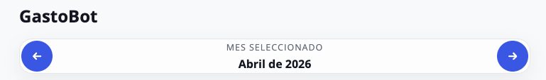
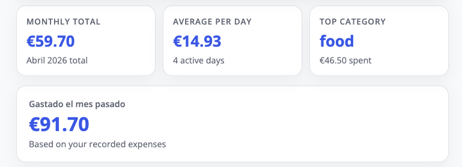
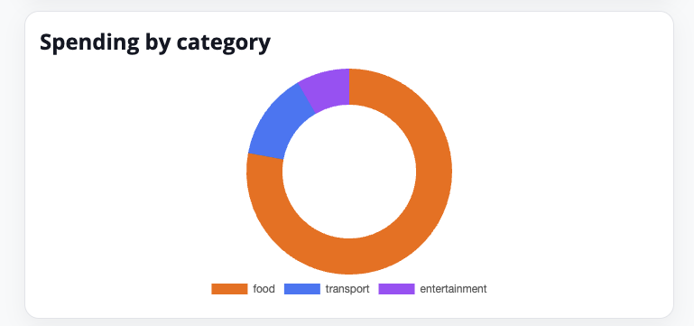
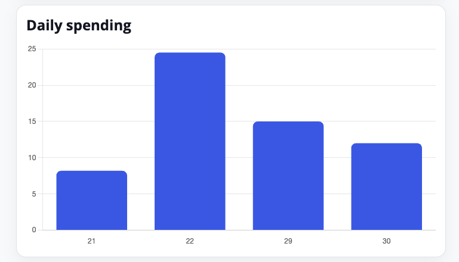
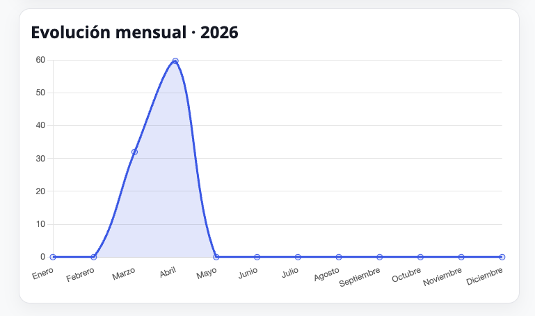

2. **Vista de gastos**
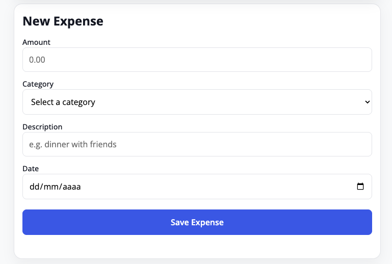
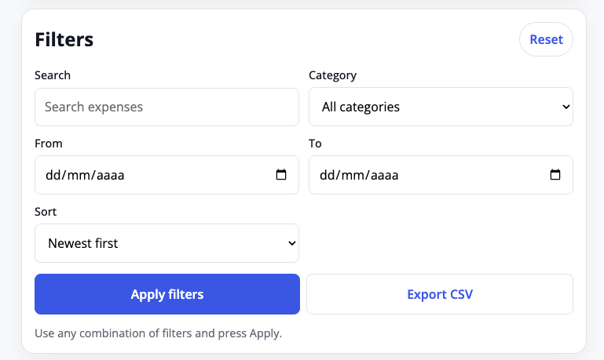
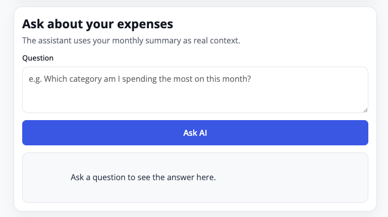
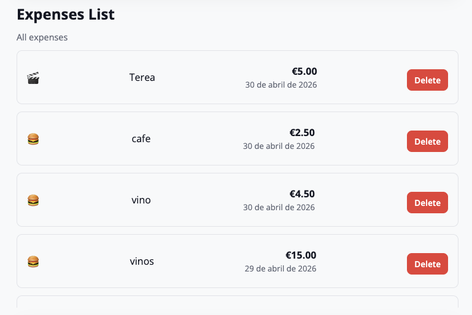
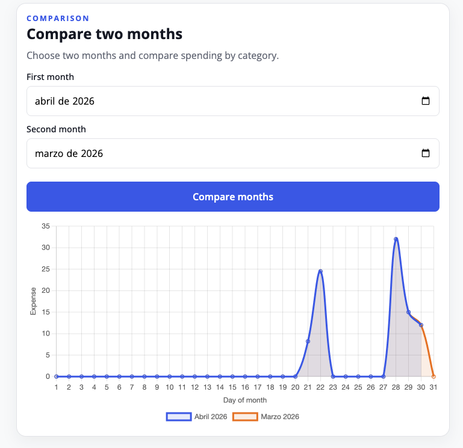

3. **Vista de reporte**
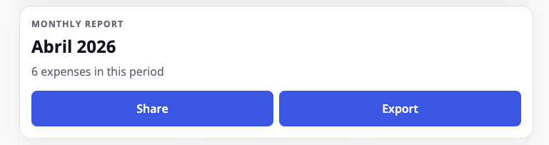
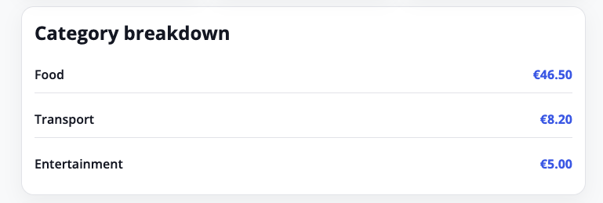

4. **Telegram**
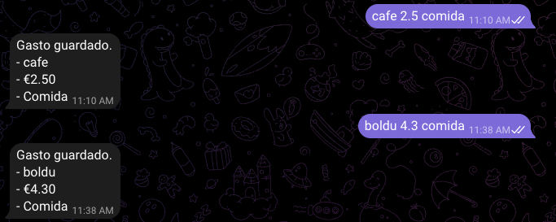
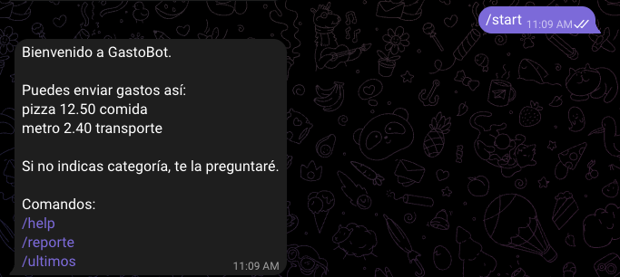

## Estructura del proyecto

```text
public/
  index.html
  app.js
  style.css
server/
  app.js
  index.js
  db/
  telegram/
api/
  expenses/
  ai/
  telegram-webhook.js
```

## Notas

- Los datos se guardan en Supabase, no en el navegador.
- El frontend está optimizado para móvil primero.
- Si cambias variables de entorno en Vercel, redeploya el proyecto.

